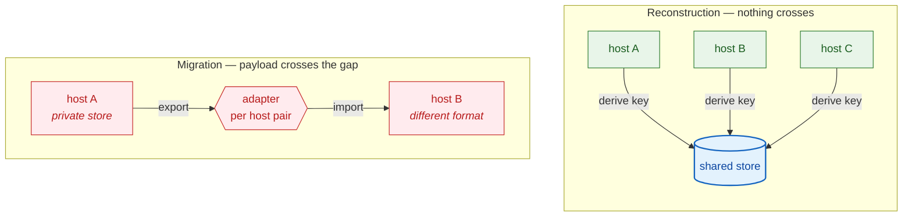
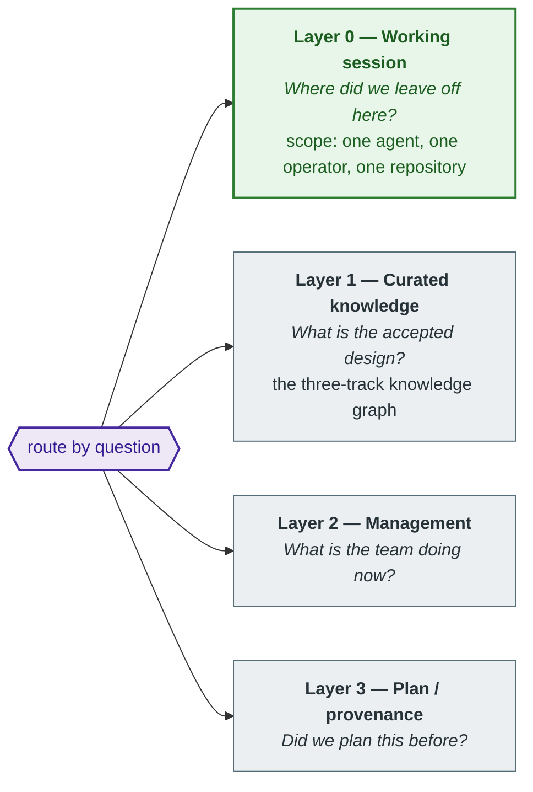

# Memory Reconstruction

**Node ID**: `knowledge:builder:memory-reconstruction`
**Type**: architecture
**Category**: builder-meta
**Created**: 2026-08-22

---

## The problem

An AgentLoom agent is not a chat window. It is a role with three knowledge
tracks, a governance protocol, and a memory model — and it is meant to be
portable across hosts, because the host is a carrier, not the agent.

That portability has a hole in it. An agent's *durable* knowledge already moves
freely: the knowledge graph, the task state, the plan history all live in a
shared store, so switching machines never loses them. What does not move is the
agent's **working state** — what it was doing, in which repository, and why.
That state is created inside whichever editor is hosting the agent today, and it
stays there.

The result is an agent that remembers the organization's accepted design but not
what it did yesterday afternoon. The first question of every session — *where
did we leave off here?* — is the one question no memory layer answers.

---

## Two ways to close the hole

The intuitive fix is to move the editor's session data to the other machine.
Call this **migration**: treat working state as a payload and carry it across.

The alternative is **reconstruction**: carry nothing, and let each host
independently *derive* the same identity from something both hosts already
have — the repository — then read the state belonging to that identity from a
shared store.

Migration fails for two independent reasons, either sufficient on its own.

It is **combinatorial**. Each host stores conversations in its own private
format, so migration needs an adapter per host pair. The cost grows
quadratically, every adapter breaks when either vendor ships a release, and
supporting a new host means writing new code. For a framework whose premise is
that the host is interchangeable, that is the wrong dependency to take on.

It is also **built on hostile ground**. Those private stores are keyed by a hash
of the absolute workspace path, so the same repository in two directories is
already two different keys before anything crosses the network. The running
editor caches them in memory rather than re-reading from disk, so an external
write is either ignored or corrupting. A memory system built on a store you do
not control has its reliability capped by someone else's release notes.

Reconstruction has neither property. There is no transfer step to break, and
supporting a new host costs a bootstrap instruction rather than an adapter — the
cost is linear in hosts instead of quadratic in host pairs.

> **The principle:** never transfer identity, derive it. Two hosts that can
> compute the same key from the same repository never need to talk to each other.

---

## What identity is made of

Reconstruction only works if every host derives *the same* key without
coordinating. That requires identity to be built from facts that are true
everywhere and that nobody configures.

A session is identified by three things: **which agent**, **which operator**,
and **which workspace**. The first two are declared. The third is derived from
the repository's version-control remote, normalized so that every transport for
the same repository — SSH, HTTPS, with or without an explicit port — collapses
to one key.

Two consequences follow, and both are load-bearing.

**A workspace is not a directory.** Identity comes from the remote and nothing
else, so an empty directory that merely declares the right remote is a valid
workspace. A machine with no clone of the repository can still resume the
session. This is also the sharpest available test that no local state leaked
into the key.

**What is excluded matters more than what is included.** Hostname, editor name,
operating system, architecture, and absolute path are all *recorded* — they make
history readable — but none may participate in a lookup. This is the design's
most dangerous failure mode, because getting it wrong produces no error: filter
a lookup on a hostname and the system works perfectly on the machine that wrote
the row, and silently returns nothing everywhere else.

Which is why, in keeping with AgentLoom's standing commitment to
*machine-executable protocols rather than suggestive instructions*, this is not
documented as a guideline. It is a test that fails if a provenance field appears
in a lookup predicate.

---

## Memory that is stratified by cost

Working state is not one thing. Recovering it needs two different objects with
opposite properties, and conflating them produces a system that is either too
thin to be useful or too slow to be used.

A **checkpoint** is a small, structured resume point: the next action, the open
plan, the state of the working tree, decisions not yet written down elsewhere.
It is cheap enough to load unconditionally at the start of every session, and
far too terse to settle an argument about a past decision.

An **archive** is the conversation itself, redacted and stored. It settles the
argument, and it is far too large to load on every resume.

Neither replaces the other, so the design keeps both and bridges them with a
third thing: a **locator** that returns *pointers* into the archive rather than
its contents. A checkpoint cites the transcript it came from; a search returns a
position within one. Recovery starts cheap and pages in detail only along the
path the agent actually asked about.

Working session memory is numbered **Layer 0** because it comes first in time,
not because the others rest on it. It is the layer touched at the start of every
session, before the agent knows which of the others it will need.

The boundary runs in both directions, and the second direction is the one people
get wrong. A checkpoint is *overwritten by the next checkpoint* — it is a
pointer, not a record. Putting a durable decision in one loses it. Durable
decisions belong in the curated knowledge graph, where the governance strand can
review them. The locator finds where something was **discussed**; it never
becomes the authority on what was **decided**.

---

## The boundary this design refuses to cross

Reconstruction restores the agent's understanding of the work. It does not
repaint the conversation as native chat bubbles inside the target editor's own
sidebar.

That is the single capability requiring writes to a host's private store, and it
is refused deliberately. The trade-off is narrower than it first sounds, and the
usual misreading is to hear it as "no conversation history at all". The
conversation does move — captured, redacted, stored, searchable, and readable on
any machine. What does not move is its *rendering inside one vendor's UI
widget*.

This is the same boundary the framework draws everywhere else. AgentLoom governs
what it can make verifiable and declines to depend on what it cannot. A memory
layer whose correctness depends on the internal file format of a product on
someone else's release schedule is not a governed layer, whatever the
documentation claims.

---

## Why this belongs to the framework, not to an agent

Every agent built with AgentLoom has this problem, because it follows from the
framework's own premise: if the host is a carrier rather than the agent, then no
part of the agent may live only in the carrier.

Reconstruction is the mechanism that makes that premise true of working state,
the last part of the agent that was still host-bound. It is deliberately
domain-free — it knows nothing about any particular agent's skills, knowledge,
or behaviors — which is why it is framework capability rather than something
each agent re-solves.

---

## See also

- `agentloom-architecture.md` — the three-track / two-role structure and the dual-helix protocol this memory model serves
- **Implementation:** [`agentloom-runtime`](https://github.com/Keven1894/agentloom-runtime) — `docs/memory/memory-reconstruction.md` for the mechanism in full detail, `docs/memory/layer-0-session-memory.md` for the host-neutrality invariants, data model, and host adapter conformance checklist
